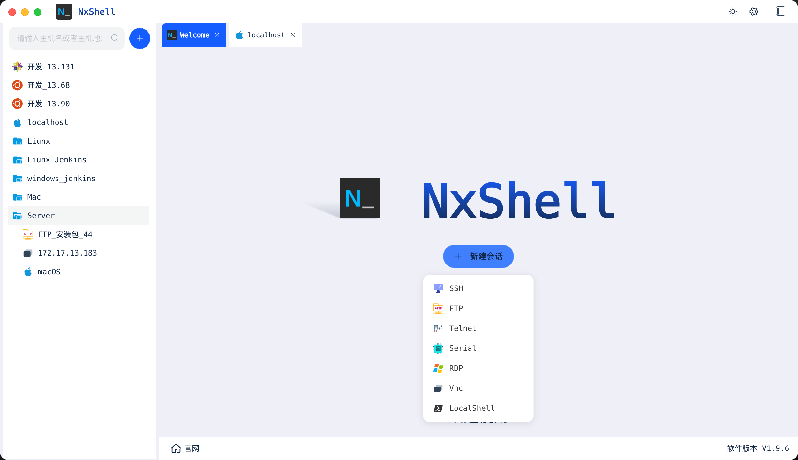

# NxShell

NxShell 是一款跨平台的 SSH、FTP等 客户端与终端工具，界面简洁、使用方便，帮助你轻松管理远程服务器与本地终端。



## 功能介绍

### 多种连接方式

| 功能 | 说明 |
| ---- | ---- |
| SSH | 远程连接服务器，执行命令行操作 |
| FTP | 远程文件上传、下载与目录管理 |
| Telnet | 连接 Telnet 协议的传统服务 |
| 串口（Serial） | 连接串口设备，适用于嵌入式等调试场景 |
| RDP | 远程桌面连接 Windows 主机 |
| VNC | 远程桌面连接其他主机 |
| 本地 Shell | 直接在本机打开终端窗口 |

## 使用说明

1. 启动 NxShell，在主页点击「新建会话」。
2. 选择连接类型（如 SSH、FTP、Telnet 等）。
3. 填写主机地址、端口、用户名、密码等连接信息。
4. 点击「连接」，即可开始使用。
5. 已保存的会话可从列表直接打开，也可在设置中管理。

## 开发与编译

> 推荐使用 Node.js 16.20.2 与 npm 8.19.4 环境。

### 环境准备

```bash
git clone https://github.com/luossji/nxshell.git
cd nxshell
npm install
```

### 开发调试

启动前端开发服务与 Electron 开发进程（两者会同时启动）：

```bash
npm run dev
```

### 编译打包

```bash
npm run build_pack
```

打包产物输出到 `dist/apppackage/` 目录。

## 声明

本软件基于开源项目 [NxShell](https://github.com/nxshell/nxshell) 构建，在此向原作者及所有贡献者致以诚挚感谢。
